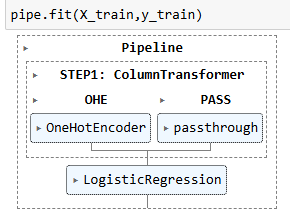
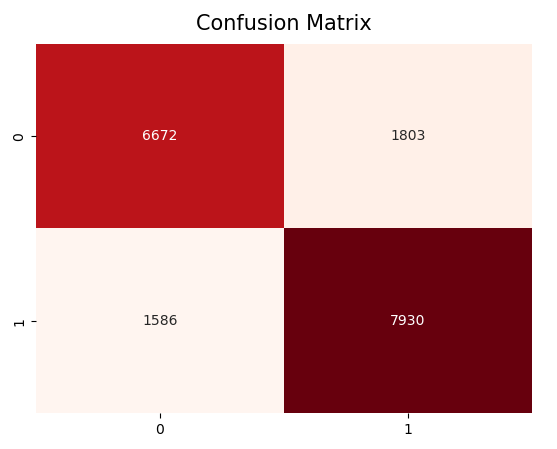
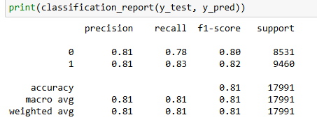
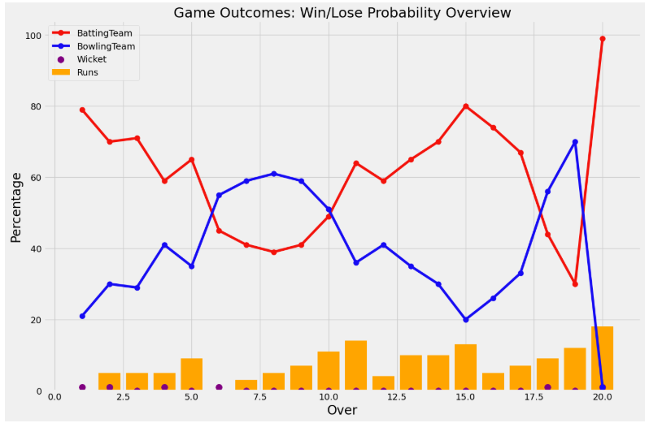

## PREDICTIVE MODELING AND PERFORMANCE ANALYSIS IN CRICKET

This repository presents my MSc Data Analytics dissertation at Dublin Business School, focused on sports analytics and predictive modeling in the Indian Premier League (IPL). 🏏

## 📌 Project Highlights

- Analyzed 950 IPL matches and 225,000+ ball-by-ball deliveries from 2008 to 2022.
- Examined batting, bowling, fielding, and team performance across IPL seasons.
- Engineered match-state features for predictive modeling.
- Built a machine learning pipeline using one-hot encoding and logistic regression.
- Achieved 81.16% test accuracy and 80.86% five-fold cross-validation accuracy.
- Generated over-by-over win probabilities for both competing teams.

## 📊 Dataset

The project uses two datasets:

| Dataset | Records | Columns | Description |
|---|---:|---:|---|
| IPL Matches | 950 | 20 | Match-level information, including teams, venues, toss decisions, results, margins, methods, umpires, and players |
| IPL Ball-by-Ball | 225,954 | 17 | Delivery-level information, including batters, bowlers, fielders, strikers, runs, boundaries, wickets, overs, extras, and innings |

**Source:** [IPL Data Set on Kaggle](https://www.kaggle.com/datasets/ramjidoolla/ipl-data-set)

## 🧭 Project Methodology

1. **Data preparation:** Examined dataset structure, data types, missing values, and inconsistencies across both datasets. Cleaned the data, standardized categorical values, and prepared the datasets for reliable analysis.
2. **Exploratory data analysis:** Investigated seasonal trends and batting, bowling, fielding, and team performance.
3. **Data integration:** Combined match-level and ball-by-ball data using match identifiers.
4. **Feature engineering:** Created match-state variables such as runs remaining, balls remaining, wickets remaining, current/required run rate, and target score to represent the situation of a match during the second innings. 
5. **Model development:** Built a scikit-learn pipeline, where categorical features were transformed using one-hot encoding and the processed data was passed into a logistic regression classifier for prediction.
6. **Model evaluation:** Evaluated the model using training/test accuracy, five-fold cross-validation, confusion matrix, precision, recall, and F1-score to assess both predictive performance and classification reliability.
7. **Probability analysis:** Generated over-by-over winning and losing probabilities during the second innings.

## 🎯 Model Performance

| Metric | Result |
|---|---:|
| Test Accuracy | 81.16% |
| Training Accuracy | 80.80% |
| 5-Fold Cross-Validation Accuracy | 80.86% |
| Weighted Precision | 0.81 |
| Weighted Recall | 0.81 |
| Weighted F1-Score | 0.81 |

#### Machine Learning Pipeline:

<p align="center">
  
</p>

#### Confusion Matrix:

<p align="center">
  
</p>

#### Classification Report:

<p align="center">
  
</p>

#### Win Probability Curve:

<p align="center">
  
</p>

Additional batting, bowling, team performance, and seasonal analysis visuals are available in [`assets/images`](assets/images).

## 📂 Repository Structure

```text
msc-dissertation/
├── README.md
├── requirements.txt
├── .gitignore
├── notebooks/
│   └── analysis_and_prediction.ipynb
├── data/
│   ├── ipl_matches_2008_2022.csv
│   └── ipl_ball_by_ball_2008_2022.csv
├── models/
│   └── ipl_win_probability_model.pkl
├── documents/
│   ├── dissertation_report.pdf
│   ├── dissertation_presentation.pdf
│   └── research_poster.pdf
└── assets/
    └── images/
```

## 🔗 Project Resources

| Resource | Description |
|---|---|
| [Analysis and Prediction Notebook](notebooks/analysis_and_prediction.ipynb) | Data loading, data preparation, data integration, exploratory analysis, feature engineering, ML pipeline, model development, and evaluation |
| [Dissertation Report](documents/dissertation_report.pdf) | Complete 68-page MSc dissertation report |
| [Dissertation Presentation](documents/dissertation_presentation.pdf) | Academic presentation summarizing the research |
| [Research Poster](documents/research_poster.pdf) | One-page visual summary of the dissertation |
| [Trained Model](models/ipl_win_probability_model.pkl) | Serialized logistic regression pipeline |

## 💻 Technology Stack

- Python
- Jupyter Notebook
- Pandas
- NumPy
- Matplotlib
- Seaborn
- Scikit-learn
- Pickle

## 🔮 Future Scope

- Integrate live match data through APIs or web scraping.
- Incorporate contextual factors such as weather, injuries, venue conditions, and team composition.
- Compare additional machine learning algorithms and probability-calibration techniques.
- Develop an interactive application for match-state predictions and visual analysis.

## 🎓 Academic Context

- **Programme:** MSc Data Analytics
- **Institution:** Dublin Business School
- **Project Type:** Applied Research Project
- **Domain:** Sports Analytics and Machine Learning
- **Submitted:** 2024
